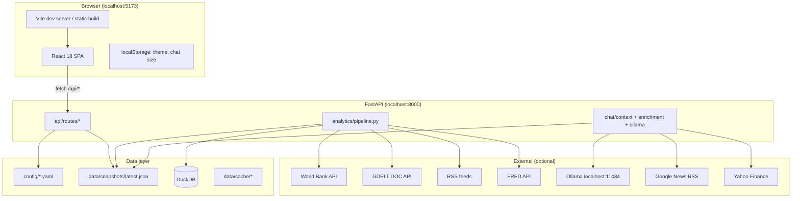
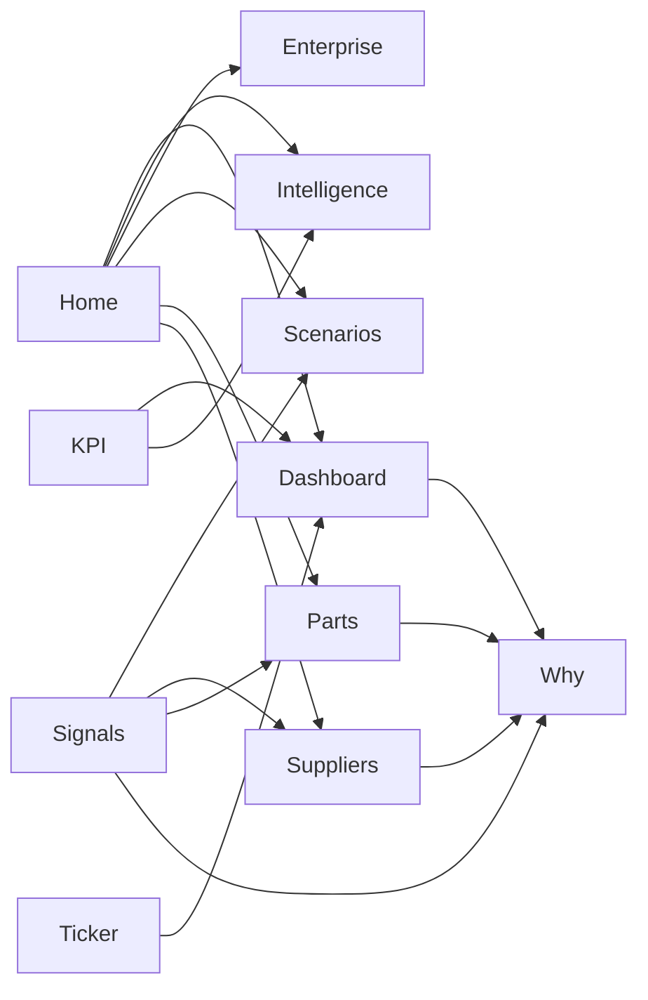

# Website reference — UI architecture & component guide

Engineering and design reference for the **Maruti Suzuki Supply Chain Command Center** React application. For narrative product tour see [storytelling.md](storytelling.md). For professor/viva Q&A (formulas, country codes, lead time) see [explanation.md](explanation.md). For clone-and-run see [README.md](README.md).

---

## Table of contents

1. [System architecture](#1-system-architecture)
2. [Application shell](#2-application-shell)
3. [Global shared components](#3-global-shared-components)
4. [Data model: Snapshot](#4-data-model-snapshot)
5. [Page: Home](#5-page-home)
6. [Page: Command center](#6-page-command-center)
7. [Page: Brief & strategy](#7-page-brief--strategy)
8. [Page: Parts catalog](#8-page-parts-catalog)
9. [Page: Suppliers](#9-page-suppliers)
10. [Page: Fear & Greed](#10-page-fear--greed)
11. [Page: Scenario lab](#11-page-scenario-lab)
12. [Page: AI & twin](#12-page-ai--twin)
13. [Overlay: Why panel](#13-overlay-why-panel)
14. [Overlay: Supply-chain chat](#14-overlay-supply-chain-chat)
15. [Routing & navigation map](#15-routing--navigation-map)
16. [Styling & theming](#16-styling--theming)
17. [Backend API ↔ UI mapping](#17-backend-api--ui-mapping)

---

## 1. System architecture

### 1.1 High-level topology



### 1.2 Frontend module layout

```
frontend/src/
├── main.tsx              # React root, ErrorBoundary
├── App.tsx               # Shell: nav, header, snapshot state, tab router
├── api/client.ts         # Snapshot types + fetch helpers
├── theme.css             # Design tokens, page-specific (fg-*, home-*, etc.)
├── pages/                # Tab views (one primary route per tab)
├── components/           # Reusable UI blocks
└── utils/
    ├── countries.ts      # ISO code → display name
    └── supplierUrls.ts   # Fallback reference_url from snapshot suppliers
```

### 1.3 State management pattern

There is **no Redux/Zustand**. State flows as follows:

| State | Owner | Scope |
|-------|--------|--------|
| `snapshot` | `App.tsx` | Entire app after `fetchLatestSnapshot` or `runAnalysis` |
| `tab` | `App.tsx` | Active main view |
| `whyPart` | `App.tsx` | Opens `WhyPanel` drawer with part id |
| `dashFocus` | `App.tsx` | Severity/signal filter when navigating to Command center |
| `theme` | `App.tsx` | `dark` \| `light` → `document.documentElement.dataset.theme` |
| Page-local UI | Each page | Filters, selected rows, open drawers |

**Implication:** Every page receives `snapshot` as a prop (or `null` before first run). Pages should not assume fields exist until after **Run analysis**.

### 1.4 Build & proxy

- **Dev:** Vite proxies `/api` → `http://127.0.0.1:8000` (see `vite.config.ts`).
- **Prod:** Serve static `frontend/dist` behind reverse proxy that forwards `/api` to uvicorn.

---

## 2. Application shell

**File:** `frontend/src/App.tsx`

The shell is a **two-column layout**: fixed sidebar + scrollable main column.

### 2.1 Sidebar (`aside.sidebar`)

| Element | CSS / behavior | Purpose |
|---------|----------------|---------|
| Brand block | `.sidebar-brand` | “MS” mark + “Command Center” subtitle |
| Nav groups | `NAV` constant | Three sections: Command, Enterprise, Supply chain |
| Nav items | `.nav-item`, `.active` | Sets `tab` state; clears `dashFocus` when leaving dashboard |
| Theme toggle | `.btn-ghost` | Persists `mscc-theme` in localStorage |

**Tab ids:** `home` | `dashboard` | `enterprise` | `parts` | `suppliers` | `feargreed` | `scenarios` | `intelligence`

### 2.2 Header (`header.app-header`)

| Element | Purpose |
|---------|---------|
| Title + subtitle | Product name and POC disclaimer line |
| Run pill | `run_id` (8 chars) + `generated_at` locale string |
| **Run analysis** button | `POST /api/run-analysis`; disables while `loading` |

### 2.3 Main column (`motion` not used at shell level)

Rendered **above** page content when snapshot exists:

1. **`LiveTicker`** — `snapshot.news_headlines`
2. **`KpiStrip`** — global KPIs (parts, suppliers, signals, AI, twin)

Then **`main.page-content`** renders the active tab page.

### 2.4 Global overlays (siblings of main, not inside tab)

| Overlay | Trigger | File |
|---------|---------|------|
| `WhyPanel` | `whyPart !== null` | `pages/WhyPanel.tsx` |
| `SupplyChainChat` | Always mounted; FAB toggles open | `components/SupplyChainChat.tsx` |

### 2.5 Cross-page navigation helpers

```typescript
goToDashboard(severity?, signalId?)  // tab → dashboard + focus
handleSignalNavigate(target, entityId?)  // signal CTA → tab or Why drawer
```

Signal targets: `dashboard`, `scenarios`, `suppliers`, `parts`, `why`.

---

## 3. Global shared components

### 3.1 `NeuralBackground.tsx`

- Full-viewport animated gradient/mesh behind all content (`z-index` below glass cards).
- Purely decorative; no interaction.

### 3.2 `LiveTicker.tsx`

| Prop | Type | Behavior |
|------|------|----------|
| `items` | `NewsHeadline[]` | Horizontal marquee of titles |
| `onItemClick` | `(index) => void` | App resolves linked `command_signals` news signal → opens dashboard with focus |

**Data:** `snapshot.news_headlines[]` — `title`, `url`, `source`, `severity`, `published_at`.

### 3.3 `KpiStrip.tsx`

| Prop | Type | Behavior |
|------|------|----------|
| `items` | `KpiItem[]` | Row of metric tiles |

`KpiItem`: `label`, `value`, `hint?`, `tone?` (`accent` \| `ok` \| `warn` \| `bad`), `onClick?`.

**App-level KPIs:** Parts tracked, Suppliers count, Ops signals (click → dashboard filter), AI fleet health, Twin network health.

Pages may render a **second** local `KpiStrip` (e.g. Dashboard ops pulse).

### 3.4 `PageHero.tsx`

Standard page header: `title`, `subtitle`, optional `badge`, `children` (actions/filters).

Used on: Dashboard, Parts, Suppliers, Fear & Greed, Scenario lab, Intelligence subtabs.

### 3.5 `ErrorBoundary.tsx`

Wraps app root in `main.tsx`; catches render errors and shows fallback UI.

### 3.6 `CitedBulletList.tsx`

Renders `CitedBullet[]` with optional external link per bullet (`source_url`, `source_label`).

Used in: `CompanyBrief`, `StrategicAnalysis`, supplier strategic panels.

### 3.7 `SuvHeroImage.tsx`

- Loads hero from `public/images/` per `suvHeroConfig.ts`.
- `HomePage` only; responsive image with gradient overlay.

### 3.8 `SupplierNameLink.tsx`

| Prop | Behavior |
|------|----------|
| `name` | Display text |
| `referenceUrl` | If set, renders `<a target="_blank" rel="noopener">` with ↗ |
| `className` | Optional style hook |

URL resolution order: entity `reference_url` → `utils/supplierUrls.ts` lookup from snapshot.

### 3.9 `SignalDetailDrawer.tsx`

Slide-over panel for a single `CommandSignal`:

- Severity badge, category, priority, full detail text
- Suggested actions list
- Navigation buttons calling `onNavigate(target, entityId)`

### 3.10 `DisruptionTimeline.tsx`

Vertical timeline of `DisruptionIncident`:

- Year, title, summary, lessons learned
- `live_analog` badge when post-run stress matches `scenario_link`
- Optional `sources[]` with URLs

### 3.11 `TireDisruptionCallout.tsx`

Compact alert card from `snapshot.tire_disruption_brief`:

- Stress level (`low` \| `medium` \| `high` \| `critical`)
- Bullet list (MRF, Gulf, scenario hooks)
- CTA to parts or scenarios

### 3.12 `FearGreedGauge.tsx`

Semicircle or compact gauge for one `FearGreedEntity`:

| Mode | Props | UI |
|------|-------|-----|
| Hero | `variant="hero"` | Large MSIL gauge, sentiment label, driver chips |
| Compact | default | Card-sized; optional `onOpenBriefing`, `referenceUrl` |

Shows **Fear** and **Greed** scores 0–100, composite sentiment label, clickable **drivers** when bulletins exist.

### 3.13 `FearGreedKnowledgePanel.tsx`

Full-screen briefing overlay:

- Header: entity name, sentiment, **×** close
- Sections: fear impact, greed impact, MSIL context, key facts, what to watch
- Footer: **Close briefing**
- **Esc** key + body scroll lock while open

### 3.14 `ModelCard.tsx`

Expandable card for one AI model in `AIHub`:

- Name, type, status, confidence, latency
- Expanded: narrative report from post-run enrichment

---

## 4. Data model: Snapshot

**Type:** `Snapshot` in `frontend/src/api/client.ts`  
**Source:** `GET /api/snapshot/latest` or response from `POST /api/run-analysis`

### 4.1 Core fields (post-run)

| Field | Used by |
|-------|---------|
| `run_id`, `generated_at` | Header pill |
| `data_health` | Debug / future health UI |
| `country_risks`, `commodity_risks`, `supplier_risks` | Dashboard risk lists, Why panel |
| `recommendations` | Dashboard rec cards, sourcing, Why |
| `sim_results` | Scenario lab tables/matrix |
| `scenario_insights` | Scenario catalog copy, insights |
| `part_rankings` | Why panel TOPSIS |
| `parts`, `parts_by_category` | Legacy/simple lists |
| `parts_catalog_enriched` | Parts catalog primary |
| `suppliers` | Supplier explorer, URL map |
| `sourcing_matrix` | Supplier sourcing tab |
| `company` | Company brief |
| `strategic` | SWOT/PESTLE |
| `fear_greed` | Fear & Greed page |
| `news_headlines` | Ticker, Dashboard news |
| `command_signals` | Dashboard signal feed |
| `ai_models` | AI Hub |
| `digital_twin` | Digital Twin |
| `disruption_history` | Timeline (also standalone API) |
| `tire_disruption_brief` | Dashboard callout, chat context |

### 4.2 Command signal shape

```typescript
CommandSignal {
  id, title, detail, severity, category, priority,
  suggested_actions[], navigate_to?, entity_id?, news_index?
}
```

Categories include: `news`, `simulation`, `supplier`, `commodity`, `tire`, `recommendation`, etc.

---

## 5. Page: Home

**Route tab:** `home`  
**File:** `frontend/src/pages/HomePage.tsx`

### 5.1 Purpose

Landing/marketing view inside the app; orients new users and surfaces run status without requiring navigation literacy.

### 5.2 Layout sections

| Section | Class / component | Details |
|---------|-------------------|---------|
| Hero | `.home-hero` | Badge, gradient title “Orchestrate your network from orbit”, lead paragraph |
| Hero visual | `SuvHeroImage` | Right column SUV image |
| CTA row | buttons | **Run analysis** (or disabled while loading); status text if no run |
| Critical strip | conditional | If `command_signals.critical_count > 0`, button → `onOpenCritical()` → dashboard filtered |
| Quick links grid | `QUICK_LINKS` | 6 cards → `onNavigate(tab)` |
| Footer note | `.muted` | Demo disclaimer |

### 5.3 Props

| Prop | Role |
|------|------|
| `snapshot` | Enables “last run” messaging and critical strip |
| `loading` | Disables duplicate run from home CTA |
| `onRunAnalysis` | Same handler as header button |
| `onNavigate` | Tab switcher |
| `onOpenCritical` | Dashboard with critical severity focus |

### 5.4 Data dependencies

Optional: `snapshot.command_signals.critical_count`. Works with `snapshot === null` (prompts first run).

---

## 6. Page: Command center

**Route tab:** `dashboard`  
**File:** `frontend/src/pages/Dashboard.tsx`  
**Also uses:** `pages/OpsPulse.tsx` (embedded section component)

### 6.1 Purpose

Operational **war room**: prioritized signals, news, risks, recommendations, tyre watch, disruption teaser.

### 6.2 Page structure (top → bottom)

```
PageHero ("Command center")
├── Local KpiStrip (OpsPulse summary metrics)
├── TireDisruptionCallout (if tire_disruption_brief)
├── DisruptionTimeline (compact / teaser mode if supported)
├── Two-column grid:
│   ├── Signal feed (filter chips: all | critical | high | medium | low)
│   └── News spotlight
├── RiskList × 3 (countries, commodities, suppliers)
└── Recommendations grid (part cards + Why buttons)
```

### 6.3 Internal helpers

| Function | Role |
|----------|------|
| `newsSeverityBadge` | Maps GDELT-style severity number → label/class |
| `signalForNews` | Links headline index to news-category signal |
| `RiskList` | Bar chart list for top-N risk entities |

### 6.4 Local state

| State | Purpose |
|-------|---------|
| `severityFilter` | Signal list filter; synced from `focusSeverity` prop via `useEffect` |
| `selectedSignal` | Opens `SignalDetailDrawer` |
| `selectedNews` | News card detail / link to signal |

### 6.5 Focus behavior (from App)

When user clicks ticker or global KPI “Ops signals”:

- `focusSeverity` → sets filter chip
- `focusSignalId` → scrolls/highlights and may auto-open drawer

### 6.6 `OpsPulse.tsx` (embedded)

Renders autopilot summary from `command_signals`:

- `autopilot_mode`, `total`, `critical_count`, `high_count`
- Tone badges for fleet health narrative

### 6.7 Data dependencies

Requires snapshot with: `command_signals`, `news_headlines`, `country_risks`, `commodity_risks`, `supplier_risks`, `recommendations`, optional `tire_disruption_brief`, `disruption_history`.

---

## 7. Page: Brief & strategy

**Route tab:** `enterprise`  
**File:** `frontend/src/pages/Enterprise.tsx`

### 7.1 Purpose

Strategic context for MSIL and the network — company facts, SWOT/PESTLE, historical disruptions.

### 7.2 Subtab router (local state)

| Subtab id | Component | File |
|-----------|-----------|------|
| `brief` | `CompanyBrief` | `CompanyBrief.tsx` |
| `strategic` | `StrategicAnalysis` | `StrategicAnalysis.tsx` |
| `history` | `DisruptionTimeline` | `DisruptionTimeline.tsx` |

Subtab buttons in `Enterprise` header row.

### 7.3 `CompanyBrief.tsx`

| Section | Data source |
|---------|-------------|
| Identity | `snapshot.company` or `fetchCompanyProfile()` |
| Business model bullets | `company.business_model` |
| Plants table | `manufacturing_footprint` |
| Product highlights | list |
| Supply chain themes | list |
| Demo metrics grid | `key_metrics_demo` |
| Disclaimer | footer |

### 7.4 `StrategicAnalysis.tsx`

| UI block | Data |
|----------|------|
| MSIL SWOT quadrants | `strategic.maruti_suzuki.swot` |
| MSIL PESTLE columns | `strategic.maruti_suzuki.pestle` |
| Partner cards | `strategic.partners[]` — per-partner mini SWOT/PESTLE |
| Search input | filters partner list client-side |

Internal: `Quadrant`, `PestleColumn` subcomponents + `CitedBulletList`.

**Note:** Can fetch standalone via `/api/company/strategic` if snapshot missing strategic block.

### 7.5 `DisruptionTimeline` (full page mode)

Uses `snapshot.disruption_history` or `fetchDisruptionHistory()`.

Shows all episodes from `supply_disruptions_history.yaml` with optional live analog flags after analysis.

---

## 8. Page: Parts catalog

**Route tab:** `parts`  
**File:** `frontend/src/pages/PartsCatalog.tsx`

### 8.1 Purpose

BOM explorer: categories, criticality, supplier linkage, post-run risk and recommendations.

### 8.2 UI components

| Element | Behavior |
|---------|----------|
| `PageHero` | Title + part count |
| Category filter chips | All or one `category` |
| Search box | Filters by name/id |
| Part cards / table rows | Per `EnrichedPartRow` |
| Supplier chips | Primary vs alternate; `SupplierNameLink` |
| Risk badge | `composite_risk_score` |
| Allocation summary | From `recommendation.allocation` |
| **Why** button | `onOpenWhy(part.id)` |

### 8.3 Data path

Primary: `snapshot.parts_catalog_enriched`

Fallback: builds from `parts` + `suppliers` + `recommendations` if enriched block absent (pre-run).

### 8.4 Key fields per part

| Field | Display |
|-------|---------|
| `criticality` | 1–5 stars |
| `main_commodity` | Tag |
| `suppliers[]` | Enriched with `topsis_rank`, `risk_score`, `trust_tier` |
| `why_summary` | Short text under card |
| `alternative_solutions` | Bullets when present |

**Featured part:** `PART-TIRE` — ties to MRF/Gulf storyline across app.

---

## 9. Page: Suppliers

**Route tab:** `suppliers`  
**File:** `frontend/src/pages/Suppliers.tsx`

### 9.1 Purpose

Two-pane supplier intelligence: directory exploration and sourcing matrix.

### 9.2 Subtab router

| Subtab | Component | File |
|--------|-----------|------|
| `directory` | `SupplierExplorer` | `SupplierExplorer.tsx` |
| `sourcing` | `SupplierSourcing` | `SupplierSourcing.tsx` |

### 9.3 `SupplierExplorer.tsx`

| Element | Details |
|---------|---------|
| Filters | Country, trust tier, text search |
| Table columns | Name (`SupplierNameLink`), country, commodities, lead time, risk, fear, greed |
| Row select | Side panel: strategic SWOT/PESTLE snippet from `supplier_strategic` |
| Part links | Jump to Why for parts supplied |

**Data:** `snapshot.suppliers` + `snapshot.supplier_risks` + `snapshot.fear_greed.entities`.

### 9.4 `SupplierSourcing.tsx`

| Element | Details |
|---------|---------|
| `SourcingCard` per part | Primary/alternate suppliers, allocation bars |
| Playbook text | `mitigation_playbook` from matrix |
| **Why** | Per-part drawer trigger |

**Data:** `snapshot.sourcing_matrix` — `parts[]` with `SourcingPartRow`.

---

## 10. Page: Fear & Greed

**Route tab:** `feargreed`  
**File:** `frontend/src/pages/FearGreedIndex.tsx`

### 10.1 Purpose

Supply-chain sentiment dashboard — not a stock market index. Combines news, risk, and simulation stress into **Fear** and **Greed** scores per entity.

### 10.2 Layout (top → bottom)

```
PageHero
KpiStrip (entity count, avg fear, bulletin count — local)
MSIL hero: FearGreedGauge variant="hero"
Supplier table (sortable)
Supplier gauge grid (FearGreedGauge compact × N)
Bulletin card grid (filters: all | news | driver | macro)
FearGreedKnowledgePanel (portal overlay when briefing open)
```

### 10.3 Local state

| State | Purpose |
|-------|---------|
| `sortKey` / `sortDir` | Table sorting |
| `bulletinFilter` | Bulletin type filter |
| `knowledgeEntity` | Active briefing entity + bulletin detail |
| `briefingBulletinId` | Which bulletin opened the panel |

### 10.4 Interactions

| Action | Result |
|--------|--------|
| Click supplier name | `SupplierNameLink` → `reference_url` |
| Click table row / “Briefing →” | Open knowledge panel for supplier |
| Click gauge driver chip | Open driver-linked bulletin |
| “Full briefing →” on card | Open entity briefing |
| × / Esc / Close briefing | Dismiss panel |

### 10.5 Helper: `bulletinForSupplier`

Maps supplier id → best matching `FearGreedBulletin` from `fear_greed.bulletins`.

### 10.6 Data

`snapshot.fear_greed`:

- `entities[]` — `FearGreedEntity` (id, name, fear, greed, label, drivers, reference_url)
- `bulletins[]` — rich text briefings
- `summary` — aggregates for KPI strip

---

## 11. Page: Scenario lab

**Route tab:** `scenarios`  
**File:** `frontend/src/pages/ScenarioLab.tsx`

### 11.1 Purpose

Explore **13 scenarios** × **3 sourcing strategies** with Monte Carlo outputs.

### 11.2 View modes (local state `view`)

| Mode | UI |
|------|-----|
| `catalog` | Scenario cards from `scenario_insights.catalog` |
| `results` | Table of `sim_results` with metrics |
| `matrix` | Heatmap: scenarios × strategies → stockout % |

### 11.3 `MetricBar` helper

Horizontal bar for `stockout_probability`, `service_level`, etc.

### 11.4 Key metrics per `SimStrategyRow`

| Field | Meaning |
|-------|---------|
| `scenario_id` | e.g. `ME-GULF-TIRE` |
| `strategy` | `single_source` \| `dual_source` \| `multi_source` |
| `stockout_probability` | SimPy Monte Carlo estimate |
| `avg_recovery_days` | Recovery time |
| `service_level` | Fill rate proxy |

### 11.5 Data

`snapshot.sim_results`, `snapshot.scenario_insights` (catalog descriptions, legend).

Standalone catalog: `GET /api/scenarios/catalog` (metadata without full sim).

---

## 12. Page: AI & twin

**Route tab:** `intelligence`  
**File:** `frontend/src/pages/Intelligence.tsx`

### 12.1 Purpose

“Future layer” — demo AI model registry and synthetic digital twin.

### 12.2 Subtab router

| Subtab | Component | File |
|--------|-----------|------|
| `ai` | `AIHub` | `AIHub.tsx` |
| `twin` | `DigitalTwin` | `DigitalTwin.tsx` |

### 12.3 `AIHub.tsx`

| Element | Data |
|---------|------|
| Fleet summary banner | `ai_models.summary` (counts, fleet_health) |
| Filter chips | status: all / active / training |
| `ModelCard` grid | `ai_models.models[]` |

Post-run, model cards include enriched **reports** (narrative paragraphs generated in pipeline).

### 12.4 `DigitalTwin.tsx`

| Element | Data |
|---------|------|
| Network health badge | `digital_twin.network_health` |
| Plant nodes | Gurgaon, Manesar, Gujarat — throughput, buffer, status |
| Link/stress indicators | Synthetic mesh edges |

Config source: `config/plants.yaml`; values jittered per run in pipeline.

---

## 13. Overlay: Why panel

**File:** `frontend/src/pages/WhyPanel.tsx`  
**Not a tab** — drawer overlay when `whyPart` set.

### 13.1 Purpose

Explain **TOPSIS ranking** and **allocation rationale** for a selected part.

### 13.2 UI sections

| Section | Content |
|---------|---------|
| Part selector | Dropdown of all parts (when not fixed) |
| Ranked suppliers table | Score per criterion, total, rank |
| Allocation bars | % per supplier from `recommendations` |
| Rationale bullets | From `rationale` object (drivers, thresholds) |
| Scenario stress callout | Max stockout scenario that triggered dual/multi |

### 13.3 Props

| Prop | Role |
|------|------|
| `selectedPartId` | Current part |
| `asDrawer` | Slide-in styling + close button |
| `onClose` | Clears `whyPart` in App |

### 13.4 Data

`part_rankings[partId]`, `recommendations`, `supplier_risks`, `sim_results` filtered by part suppliers.

---

## 14. Overlay: Supply-chain chat

**File:** `frontend/src/components/SupplyChainChat.tsx`

### 14.1 Purpose

Floating **Ollama** assistant grounded in latest snapshot + live news/finance enrichment.

### 14.2 UI anatomy

```
FAB (💬) fixed bottom-right
└── Panel (when open)
    ├── Resize grip (top-left) — drag to resize
    ├── Header: title, Ollama status dot, Refresh, Reset size, Close
    ├── Message list (user / assistant)
    ├── Starter prompt chips
    └── Input + Send (streaming)
```

### 14.3 Persistence

| Key | Storage |
|-----|---------|
| `mscc-chat-panel-size` | `{ width, height }` in localStorage |
| Messages | In-memory only (session) |

### 14.4 API flow

1. `GET /api/chat/status` — model availability  
2. `POST /api/chat` — SSE stream; strips `` reasoning blocks from DeepSeek R1  

Backend: `backend/chat/context.py` builds system prompt; `enrichment.py` adds RSS/Yahoo before call.

### 14.5 Props

`snapshot` — passed from App; chat quality improves significantly after a full run.

---

## 15. Routing & navigation map

There is **no React Router** path URL — tabs are pure React state.



**Deep linking:** Not implemented; refreshing browser returns to default tab `home` unless you add router (future enhancement).

---

## 16. Styling & theming

**File:** `frontend/src/theme.css`

### 16.1 Design system

| Token | Usage |
|-------|--------|
| `data-theme="dark"` \| `"light"` | Root attribute toggled by App |
| `.glass` | Frosted card surfaces |
| `.card` | Content containers |
| `.btn-primary`, `.btn-ghost` | Actions |
| Severity: `.high`, `.warn`, `.ok` | Signals, news, risks |
| `.text-gradient` | Hero emphasis |

### 16.2 Page-specific prefixes

| Prefix | Page |
|--------|------|
| `home-*` | HomePage |
| `fg-*` | Fear & Greed (gauges, bulletins, knowledge panel, supplier table) |
| `chat-*` | SupplyChainChat |
| `twin-*` | DigitalTwin |
| `signal-*` | Signal feed / drawer |

### 16.3 Motion

Framer Motion used selectively on Fear & Greed and hero sections (`motion` from `framer-motion`).

---

## 17. Backend API ↔ UI mapping

| UI surface | Primary API | Snapshot field |
|----------|-------------|----------------|
| Run analysis | `POST /api/run-analysis` | entire object |
| All tabs | `GET /api/snapshot/latest` | entire object |
| Company brief | `GET /api/company/profile` | `company` |
| SWOT/PESTLE | `GET /api/company/strategic` | `strategic` |
| Parts (standalone) | `GET /api/parts/catalog/enriched` | `parts_catalog_enriched` |
| Suppliers dir | `GET /api/suppliers/catalog` | `suppliers` |
| Sourcing matrix | `GET /api/sourcing/matrix` | `sourcing_matrix` |
| Fear & Greed | `GET /api/sentiment/fear-greed` | `fear_greed` |
| Scenarios meta | `GET /api/scenarios/catalog` | `scenario_insights` |
| AI models | `GET /api/ai/models` | `ai_models` |
| Digital twin | `GET /api/digital-twin/status` | `digital_twin` |
| Signals only | `GET /api/command/signals` | `command_signals` |
| Disruption history | `GET /api/disruptions/history` | `disruption_history` |
| Chat | `POST /api/chat`, `GET /api/chat/status` | reads `latest.json` server-side |

### 17.1 Pipeline modules (backend reference)

| Module | Output in snapshot |
|--------|-------------------|
| `ingestion/orchestrator.py` | headlines, data_health |
| `analytics/risk.py` | country/commodity/supplier risks |
| `analytics/mcdm.py` | part_rankings, mcdm |
| `analytics/simulation.py` | sim_results |
| `analytics/recommendations.py` | recommendations, sourcing_matrix |
| `analytics/fear_greed.py` | fear_greed |
| `analytics/fear_greed_bulletins.py` | bulletins |
| `analytics/command_signals.py` | command_signals |
| `analytics/tire_brief.py` | tire_disruption_brief |
| `analytics/disruption_history.py` | disruption_history |
| `analytics/ai_hub.py` | ai_models |
| `analytics/digital_twin.py` | digital_twin |
| `analytics/pipeline.py` | orchestrates all → JSON |

---

## Appendix A — File index (pages)

| File | Tab / role |
|------|------------|
| `HomePage.tsx` | home |
| `Dashboard.tsx` | dashboard |
| `OpsPulse.tsx` | dashboard section |
| `Enterprise.tsx` | enterprise router |
| `CompanyBrief.tsx` | enterprise › brief |
| `StrategicAnalysis.tsx` | enterprise › strategic |
| `PartsCatalog.tsx` | parts |
| `Suppliers.tsx` | suppliers router |
| `SupplierExplorer.tsx` | suppliers › directory |
| `SupplierSourcing.tsx` | suppliers › sourcing |
| `FearGreedIndex.tsx` | feargreed |
| `ScenarioLab.tsx` | scenarios |
| `Intelligence.tsx` | intelligence router |
| `AIHub.tsx` | intelligence › ai |
| `DigitalTwin.tsx` | intelligence › twin |
| `WhyPanel.tsx` | overlay drawer |

## Appendix B — File index (components)

| File | Role |
|------|------|
| `NeuralBackground.tsx` | Ambient background |
| `LiveTicker.tsx` | News marquee |
| `KpiStrip.tsx` | Metric tiles |
| `PageHero.tsx` | Page titles |
| `SignalDetailDrawer.tsx` | Signal detail slide-over |
| `DisruptionTimeline.tsx` | History timeline |
| `TireDisruptionCallout.tsx` | Tyre/MRF/Gulf alert |
| `FearGreedGauge.tsx` | Sentiment gauge |
| `FearGreedKnowledgePanel.tsx` | Briefing overlay |
| `SupplierNameLink.tsx` | External supplier links |
| `SuvHeroImage.tsx` | Home hero image |
| `CitedBulletList.tsx` | Sourced bullets |
| `ModelCard.tsx` | AI model card |
| `SupplyChainChat.tsx` | Floating chat |
| `ErrorBoundary.tsx` | Error fallback |

---

*Last aligned with project feature set: Fear & Greed briefings, supplier reference URLs, resizable chat, disruption timeline, MRF/Gulf tyre narrative.*
